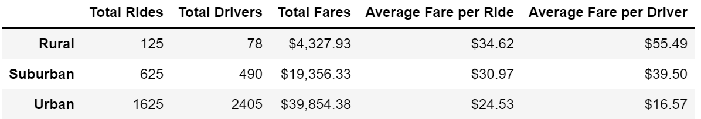
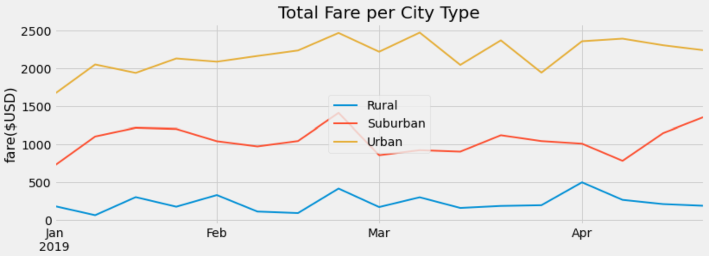

# PyBer_Analysis

## Overview of the Analysis

This project is to provide analysis on PyBer revenue comparison in three city types: urban, suburban, and rural. The analysis is based on data from January 2019 to May 2019. It provides a summary on total rides, total drivees, total fares, average fare per ride, and average fare per driver for each of the three city types. It also provides a summary on total weekly fare per city type based on data from January 2019 to April 2019. The user of this analysis should be able to identify which city type generates the highest PyBer revenue. 

## Results

Below is a summary of difference in ride-sharing data among the three city types:

### Total Rides

The number of rides in Urban is the highest whereas the number in Rural is the lowest. The total ride number in Urban is 13 times the number in Rural and is 2.6 times the number in Suburban. This indicates Urban has the highest demand on PyBer rides.

### Total Drivers

The high demand on rides in Urban attracts more drivers to PyBer business. The number of drivers in Urban is the highest whereas the number in Rural is the lowest. The total driver number in Urban is 30 times more than the total driver number in Rural and is roughly 5 times the total driver number in Suburban. 

### Total Fares

Total fares represents the total revenue in each city type. As a result of more total rides, Urban has the highest total fares amount. It is almost 10 times the revenue in Rural and twice the revenue the Suburban. 

### Average Fare per Ride

Rural has the highest average fare per ride and Urban has the lowest average. For each ride, average fare in Rural is around $10 more than the average fare in Urban and is around $5 more than the average in Suburban. One explanation may be the distance of the rides. In urban area, the destination tends to be closer with a higher density of buildings and roads, whereas in rural area, large agricultural areas resulting in longer travel distance. 

### Average Fare per Driver

Rural has the highest average fare per driver and Urban has the lowest average. For each driver, average are in Rural is around $40 more than the average fare in Urban and is around $15 more than the average in Suburban. The reason could be the lower number of drivers available in rural area.

### Total Fare by City Type

From the data based on January 2019 to April 2019, Urban has the highest total fares and Rural has the lowest total fares for every week in every month. The total fare within each city type does not vary a lot in different months. In all months, the total weekly fare in Rural ranges from $50 to $500, the total weekly fare in Suburban ranges from $450 to $1400, and the total weekly fare in Urban ranges from $1600 to $2500.

## Summary

Based on the result of the analysis, we propose the following recommendations for PyBer:
- Since Urban generates the highest total revenue, PyBer should focus its business in urban areas;
- Although Suburban’s total revenue is half of the revenue in Urban, the total number of drivers is a lot less than it is in Urban. This indicates that there is demand for rides in Suburban but not sufficient number of drivers to fulfill the demand. PyBer could hire more drivers in suburban area and reduce some driver number in urban area;
- The high average fare per driver in Rural may also indicate that there is not enough drivers in rural area. PyBer could hire more drivers in rural areas so that it may increase customer satisfaction by reducing the wait time for a ride, and in turn, increase the ride demand and total revenue. 
